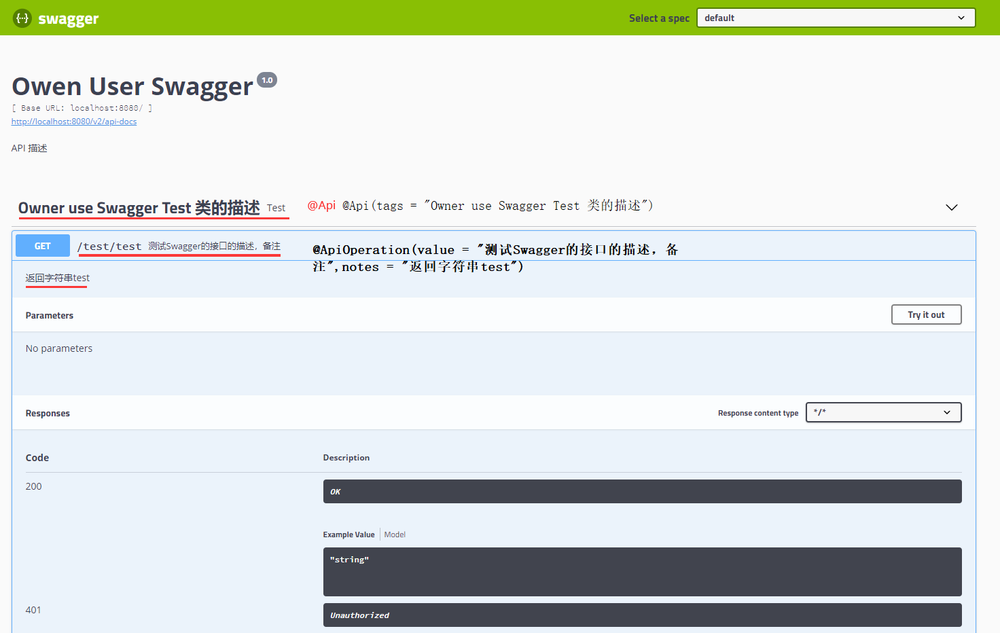
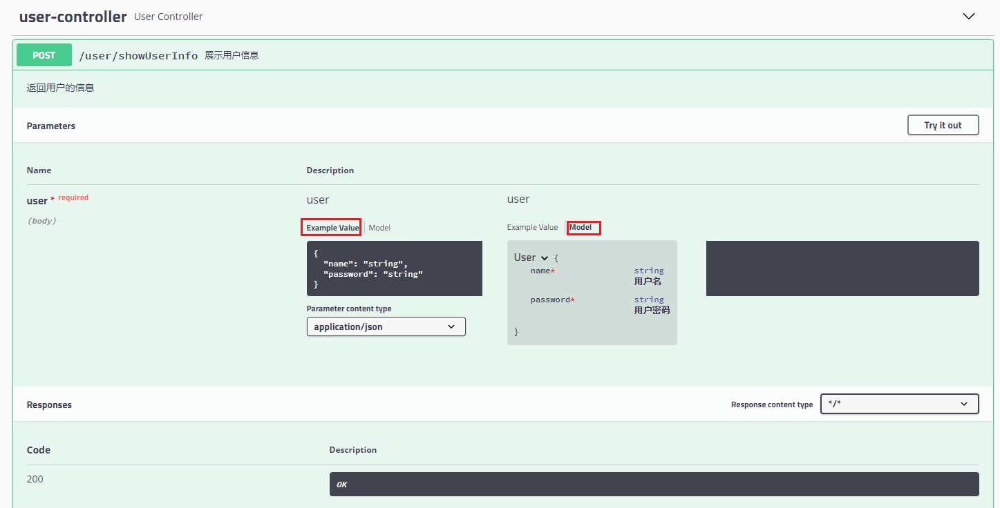

[TOC](目录)

#Swagger
# 什么是Swagger

#SpringBoot如何使用Swagger
1. 首先添加依赖
```xml
<dependency>
    <groupId>io.springfox</groupId>
    <artifactId>springfox-swagger2</artifactId>
    <version>2.9.2</version>
</dependency>
<dependency>
    <groupId>io.springfox</groupId>
    <artifactId>springfox-swagger-ui</artifactId>
    <version>2.9.2</version>
</dependency>
<dependency>
    <groupId>org.springframework.boot</groupId>
    <artifactId>spring-boot-starter-web</artifactId>
</dependency>
```
2. 提供一个Docket的Bean
即提供一个Swagger的配置类，首先使用@EnableSwagger2启用Swagger2
其次，配置一个Docket Bean，这个Bean配置映射路径和要扫描接口的位置，在apiInfo中是配置Swagger2网站信息
最后启动项目，访问http://localhost:8080/swagger-ui.html页面。
> 使用时注意吧Bean加入Spring
> 类上@Configuration注解
> 方法上@Bean

类详情
```java
package ink.poesy.life.config;

import org.springframework.context.annotation.Bean;
import org.springframework.context.annotation.Configuration;
import springfox.documentation.builders.ApiInfoBuilder;
import springfox.documentation.builders.RequestHandlerSelectors;
import springfox.documentation.service.ApiInfo;
import springfox.documentation.spi.DocumentationType;
import springfox.documentation.spring.web.plugins.Docket;
import springfox.documentation.swagger2.annotations.EnableSwagger2;

@Configuration
@EnableSwagger2
public class SwaggerConfig {

    @Bean
    public Docket createRestApi(){
        return new Docket(DocumentationType.SWAGGER_2)
                .pathMapping("/")
                .select()
                .apis(RequestHandlerSelectors.basePackage("ink.poesy.life.controller"))
                .build().apiInfo(apiInfo());

    }

    /**
     * 构建 api文档的详细信息函数,注意这里的注解引用的是哪个
     * @return
     */
    private ApiInfo apiInfo() {
        return new ApiInfoBuilder()
                //页面标题
                .title("Owen User Swagger")
                //版本号
                .version("1.0")
                //描述
                .description("API 描述")
                .build();

    }
}
```
3. 启动后就可以使用了
4. 让我来测试一下
编写类如下
```java
package ink.poesy.life.controller;

import io.swagger.annotations.Api;
import io.swagger.annotations.ApiOperation;
import org.springframework.web.bind.annotation.GetMapping;
import org.springframework.web.bind.annotation.RequestMapping;
import org.springframework.web.bind.annotation.RestController;

@Api(tags = "Owner use Swagger Test 类的描述")
@RestController
@RequestMapping("/test")
public class Test {
    @ApiOperation(value = "测试Swagger的接口的描述，备注",notes = "返回字符串test")
    @GetMapping("/test")
    public String test(){
        return "test";
    }
}
```
效果如下


## @ApiModelProperty()
 用于方法，字段； 表示对model属性的说明或者数据操作更改 
   > value–字段说明 
   > name–重写属性名字 
   > dataType–重写属性类型 
   > required–是否必填 
   > example–举例说明 
   > hidden–隐藏

使用效果
</br>
首先创建一个接收请求的controller，POST传入一个User对象
```java
package ink.poesy.life.controller;

import ink.poesy.life.pojo.User;
import io.swagger.annotations.Api;
import io.swagger.annotations.ApiOperation;
import org.springframework.web.bind.annotation.PostMapping;
import org.springframework.web.bind.annotation.RequestBody;
import org.springframework.web.bind.annotation.RequestMapping;
import org.springframework.web.bind.annotation.RestController;

@RestController
@Api(value = "用于用户相关的请求")
@RequestMapping("/user")
public class UserController {

    @ApiOperation(value = "展示用户信息",notes = "返回用户的信息")
    @PostMapping("/showUserInfo")
    public String showUserInfo(@RequestBody User user){
        return user.toString();
    }
}
```
创建user对象添加 @ApiModelProperty(value = "用户名",required = true)描述
```java
package ink.poesy.life.pojo;

import io.swagger.annotations.ApiModelProperty;
import lombok.Data;

@Data
public class User {
    /**
     * 用户名
     */
    @ApiModelProperty(value = "用户名",required = true)
    private String name;
    /**
     * 密码
     */
    @ApiModelProperty(value = "用户密码",required = true)
    private String password;
}
```
效果图


---

# 对象接收
前后端传入参数时，字符对应不上使用@JsonProperty("bUserName")
来把该属性的名称序列化为另外一个名称
* JsonProperty是位于jackson包里面，
  搭配ObjectMapper().writeValueAsString(实体类)方法使用，将实体类转换成字符串。
* JSONField是位于fastjson包里面，
搭配JSON.toJSONString(实体类)方法使用，将实体类转换成json字符串。搭配JSON.parseObject(字符串,实体类.class)方法使用，将字符串转换成实体类。

---

# 使用logger.isInfoEnable()
简单来说，就是用isDebugEnabled方法判断下是能提升性能的。
（From: http://blog.sina.com.cn/s/blog_616b57310100f36s.html ）

 if (logger.isInfoEnabled()) {         
    logger.info("User " + userId + " is using app " + appId);     
 }
为什么要加上logger.isInfoEnabled()？原因有两点。
1. 直接使用logger.info("User " + userId + " is using app " + appId)来输出log，
也能够达到log级别为INFO或在INFO以下时才输出：
("User " + userId + " is using app " + appId)，
因为logger.info方法内部有判断输出级别的代码。
但是在进入logger.info函数之前，("User " + userId + " is using app " + appId) 
这个表达式已经通过运算拼接成了一个字符串；
而如果事先使用 if (logger.isInfoEnabled())进行判断，
那么当log级别在INFO以上时，就能省去上述的字符串操作，
在高并发和复杂log信息拼接的情况下，使用这种标准的方法输出log能够省去不小的系统开销。
另外，如果构造log信息的过程需要大量字符串操作，建议使用StringBuilder来完成字符串拼接。
2. ERROR及其以上级别的log信息是一定会被输出的，
所以只有logger.isDebugEnabled和logger.isInfoEnabled方法，
而没有logger.isErrorEnabled方法。

# 配置Slf4j
## springboot使用Slf4j的方法
1. 首先开启日志
```xml
    <!--        开启日志-->
    <dependency>
        <groupId>org.springframework.boot</groupId>
        <artifactId>spring-boot-starter-logging</artifactId>
        <version>2.1.7.RELEASE</version>
        <scope>compile</scope>
    </dependency>
```